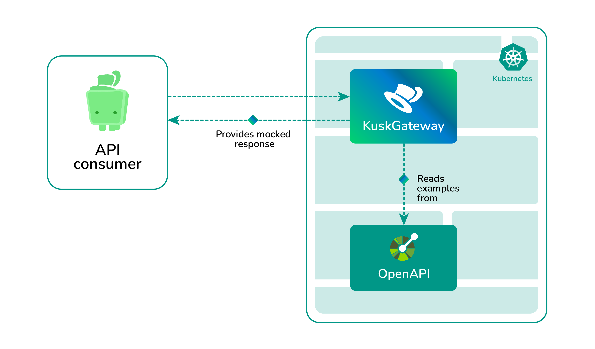

# Rapidly prototype your APIs on Kubernetes with Kusk Gateway

[OpenAPI](https://www.openapis.org/) (f.k.a Swagger) has introduced a set of standardized specifications for REST APIs that, among many things, allows producers and consumers of APIs to work together in designing an API before even writing a single line of code!

This design-first approach has improved the experience of API developers by giving them the opportunity to use tools like [OpenAPI generator](https://openapi-generator.tech/) which takes an OpenAPI definition and generates scaffolding code for backenders, making the development of APIs much faster. 

But consumers of APIs still didn’t have a way of really taking advantage of this design-first approach as they still depended on the backend teams to implement and deploy APIs.

**How could consumers of APIs then take advantage of OpenAPI and the design-first approach?**

By making the API gateway aware of the OpenAPI definition. Let me explain how!

An API gateway sits in front of your microservices routing incoming traffic that your Kubernetes cluster receives to the corresponding microservice. By having the API gateway be aware of your OpenAPI definition it can then see what a response would look like and generate a mock (or fake) response for the consumers instead.

This approach would allow API consumers to start using the API with mocked results and meanwhile (in parallel!) the backend team can start implementing the actual API; it essentially loses the dependency between consumer and producer teams and allows for quicker prototyping of the API. With no code whatsoever, just your run-of-the-mill OpenAPI definition. 



In this tutorial, you will learn how to use [Kusk Gateway](https://github.com/kubeshop/kusk-gateway), an open-source OpenAPI-driven API gateway, to enable this rapid prototyping development! Let’s make a simple example of how to achieve this:

## Walkthrough

### 1. Install Kusk Gateway CLI

```
brew install kubeshop/kusk/kusk
```

For other installation methods, check the [installation docs](https://kubeshop.github.io/kusk-gateway/cli/overview/).

### 2. Install Kusk Gateway in your Kubernetes cluster

```
kusk install
```

### 3. Create an OpenAPI definition

Create the file `openapi.yaml` with the content:

```yaml
openapi: 3.0.0
info:
  title: simple-api
  version: 0.1.0
x-kusk:
  cors:
    origins:
      - "*"
    methods:
      - GET
  mocking: 
    enabled: true
paths:
  /hello:
    get:
      responses:
        '200':
          description: A simple hello world!
          content:
            application/json:
              schema:
                type: object
                properties:
                  message:
                    type: string
              example:
                message: Hello from a mocked response!
```

This is a simple common OpenAPI definition for a single `/hello` route that accepts a GET method. There are a couple of important details here: 

### 1. The `x-kusk` extension 

This section is an extension to the OpenAPI specification. We use it to configure Kusk Gateway to enable in this case CORS access and mocking of the API. This approach makes OpenAPI the definition of your API *and* your gateway configuration(!) essentially having a single source of truth. 

### 2. The `example` field

To allow Kusk Gateway to generate mock responses, you'll need to define examples of your responses under OpenAPI's `example` field. In this case we have an example message "Hello from a mocked response!". 

## 4. Apply the API configuration to the cluster

```sh
 kusk api generate -i openapi.yaml --envoyfleet.name kusk-gateway-envoy-fleet | kubectl apply -f -
```

This applies the configuration to the gateway and deploys the API. 

## 5. Test your mocked API

Now you are ready to test the API and build against mocked responses!

First, you need to get the External IP of the gateway, i.e. the entry point of your APIs. For that run: 

```sh
kubectl get -n kusk-system svc/kusk-gateway-envoy-fleet
```

Note: if you're running a local cluster with Minikube, the ExternalIP might be in pending state; in case it is, you can port-forward to the gateway by running `kubectl port-forward -n kusk-system svc/kusk-gateway-envoy-fleet 8080:80`, so your external IP becomes `localhost:8080`. 

And now test the `/hello` path: 

```sh
curl $EXTERNAL_IP/hello

{"message": "Hello from a mocked response!"}
```

And that's it! You can see that this is the same response that was defined in our OpenAPI definition. Now your API consumer teams can already start working with the mocked API!

Once the API team has implemented the service, you will stop mocking your endpoint and connect it to a microservice in your cluster. That's what we'll cover in the next sections.

## 6. Deploy your application to the cluster

Deploy this example application that we will connect with the API gateway: 

```sh
kubectl apply -f https://gist.githubusercontent.com/aabedraba/e9e7a48c7bc48386f4dadd0d9fe3b7df/raw/9048bcae0675dade44a2cd4b091e752acafaf960/hello-kubernetes.yaml
```

## 7. Connect your application to Kusk Gateway

Now, you will need to disable the mocking for your API and connect the upstream. Update your `openapi.yaml` file with the following changes:

```diff
x-kusk:
  cors:
    origins:
      - "*"
    methods:
      - GET
-  mocking: 
-    enabled: true
+  upstream:
+    service:
+      name: hello-world-svc
+      namespace: default
+      port: 8080
```

Apply the changes again with 

```sh
 kusk api generate -i openapi.yaml --envoyfleet.name kusk-gateway-envoy-fleet | kubectl apply -f -
```

## 8. Test your implemented application

With the same External IP from step 5, run 

```sh
curl $EXTERNAL_IP/hello

{"message": "Hello from an implemented service!"}

```

Voilá! You've just implemented and connected a service to your gateway!

You can find the code for the article [on Github](https://github.com/aabedraba/kusk-examples/tree/main/rapid-prototype).

## Conclusions

Kusk Gateway enabled you to take advantage of OpenAPI and a design-first approach to allow your teams to work in parallel once they've agreed on a specific API design. Nothing should have be stopping them anyway!

Having an OpenAPI-aware gateway allows you to reap more advantages of the [OpenAPI lifecycle](https://kubeshop.io/blog/the-apiops-lifecycle-managing-api-workflows-through-the-open-api-definition), like for example [automatic validation of your APIs](https://kubeshop.github.io/kusk-gateway/guides/validation/) and more!

Head over to the [Kusk Gateway documentation](https://kubeshop.github.io/kusk-gateway/getting-started/installation/) to try it out and explore all the benefits of an OpenAPI-driven gateway! We would love to hear your thoughts and ideas in our [Discord server](https://discord.gg/uNuhy6GDyn) or just drop by if you to say hi :) 

Thank you!